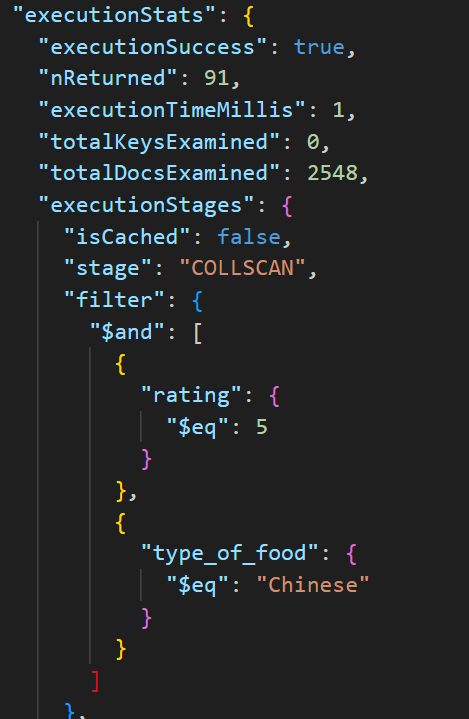

# TEMA 1 MongoDB \- Arquitectura y Tecnologías del Software (ATS)

# TASQUES OBLIGATÒRIES:

## 1- Disseny de l’esquema de la base de dades:

- Els restaurants i les inspeccions estan relacionades amb una estructura one-to-many. Hi han més d’una inspecció per restaurant. Conceptualment, no té sentit una relació one-to-millions perquè es necessita molt temps per generar tantes inspeccions.  
- Escollir que és millor si documents incrustats (embedded) o referències depèn molt de cas d’ús. Si la relació entre documents és de contenció, fer servir documents incrustats pot millorar el rendiment de les consultes ja que les dades es troben més a prop, reduint el número de consultes a fer. En cas que les incrustacions del documents provoqui duplicacions o els dos documents no es cerquin molt sovint en una mateixa consulta, fer servir referències pot se una millor opció ja que es redueix el tamany de les dades retornades per la consulta.  
  En el nostre cas d’ús, fer servir referències és correcte ja que en pocs casos es necessiten consultar els documents d’inspeccions i restaurants a la vegada. Si necessitem tots dos documents junts, podem fer un pas de $lookup en una consulta d'agregació per incrustar els documents.  
- Els esquemes de les col·leccions restaurants i inspeccions es troben en la carpeta scripts en els fitxers:  schemaOfInspections.js i schemaOfRestaurants.js

## 2- Implementació de consultes en MongoDB

El codi de totes les consultes d’aquestes consultes es pot trobar en la carpeta scripts/obligatori. Els resultats de les consultes són:

- “Buscar todos los restaurantes de un tipo de comida específico (ej. "Chinese").”

- “Listar las inspecciones con violaciones, ordenadas por fecha”

- “Encontrar restaurantes con una calificación superior a 4.”

## 3- Ús d'Agregacions

Igual que en l’anterior apartat, el codi es troba en la carpeta scripts/obligatori. Els resultats de les consultes són:

- “Agrupar restaurantes por tipo de comida y calcular la calificación promedio”

- “Contar el número de inspecciones por resultado y mostrar los porcentajes”  
    
  
- “Unir restaurantes con sus inspecciones utilizando $lookup”: Per aquesta consulta, primerament s’ha necessitat canviar el tipus del camp *restaurant\_id* a *ObjectId* per a que a la consulta d’agregació no hi hagin errors. Això es pot aconseguir amb la següent consulta d’actualització:  
  
  Ara es pot fer la consulta amb:  
  

	Els resultats de la consulta són:  

# Tasques Avançades:

## 1- Optimització de rendiment:

- Per la col·lecció de restaurants, considerem com el cas d’ús més probable buscar restaurants segons el seu tipus de menjar i la puntuació que aquest tenen. En el cas de la col·lecció d’inspeccions, buscar segons el resultat creiem que serà el més comú, ja que és molt interessant tenir controlat els restaurants que no han passat les inspeccions o han tingut un o més avisos. També hem pensat en buscar segons dates però amb el camp de dates actual no es podria crear una bona partició. Pot ser que afegir un camp com mes/any de la inspecció podria ajudar en aquest cas d’ús, però hem decidit no afegir més camps la col·lecció.  
- Per la col·lecció de restaurants hem creat un índex compost entre *type\_of\_food* i *rating*, per aixì millorar el temps de les cerques que facin servir els dos camps. El codi per crear el index és:  
   
  En el cas de la col·lecció de inspeccions hem decidit fer servir un índex simple. El codi és el següent:  
   
- Per comprovar el rendiment de les consultes fent i no fent servir els índexs, hem creat la següent consulta per trobar els restaurants de menjar xinès amb una puntuació de 5\.

Els resultats d’executar .explain() abans de crear el index:  
	  
	Els resultats d’executar .explain() després de crear el index:  
	  
Com es pot veure, fent servir el index compost es comproven meny documents. Hem passat de mirar 2548 documents a només 91\. El execution time també ha baixat d’aproximadament 1 mil·lisegon a 0 amb pocs mil·lisegons.  
Per la col·lecció inspeccions hem fet servir la següent consulta:  
  
Els resultats d’executar .explain() abans de crear el index:  
  
	Els resultats d’executar .explain() després de crear el index:  
  
Un altre cop es pot veure com s’ha reduït la quantitat de camps examinats. Hem passat de 6370 a 1291\.

## 2- Estratègies d’escalabilitat

- Les claus de fragmentació segons col·lecció que hem escollit són:  
  - Restaurants: creiem factible fer servir els camps *rating* i *type\_of\_food* per un *sharding* per rangs*.* D’aquesta manera cada shard pot emmagatzemar dades d’un tipus de menjar concret per un una puntuació concreta. Hem escollit aquesta combinació de camps per a aixì tenir una cardinalitat més gran i evitar desbalanceig. Un altre motiu és que el sharding per rangs s’acopla molt bé a les possibles consultes a aquesta col·lecció.  
  - Inspeccions: per aquesta col·lecció veiem necessari fer servir un sharding amb hash ja que els camps que té i les seves combinacions no ens donen una cardinalitat aceptable. Podem crear un nou camp que guardi l’any de la inspecció (el mateix indicat al camp *date*) per així poder combinarlo amb el resultat i millorar la cardinalitat, però no hem volgut modificar la col·lecció amb nous camps per aixì mantenir l’estat original. A més, no veiem una avantatge fer *sharding* per rangs ja que considerem que les consultes a aquesta col·lecció poques vegades cercaren per un valor concret.  
- Per mantenir una alta disponibilitat de les dades hem escollit crear *shards* amb 5 répliques i un *arbiter.* Aquest número de rèpliques és per a poder repartir la carga de les lectures entre els nodes secundaris i  a més a més, si és necessari, tenir un node encarregat de tasques de report i/o *background*. S’ha inclós l’*arbiter* per així en cas de perdre un node continua amb un número impar d’integrants en les votacions.  
- Aquesta configuració té un bottleneck en les consultes amb valors específics a la col·lecció d’inspeccions, ja que hem escollit un *sharding* per *hash* i fa que les consultes es dispersin entre els *shards.* No obstant, creiem que aquest tipus de consultes seran molt atípiques i preferim un millor balanceig de les dades entre els *shards.* Per últim, no hem considerat afegir *delayed replica* ja que no veiem mantenir un backup de l’estat anterior una necessitat per aquest domini.
